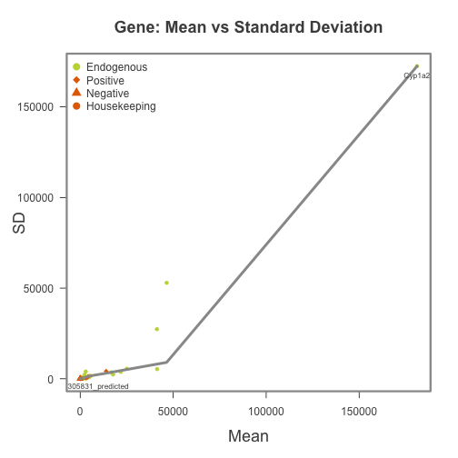
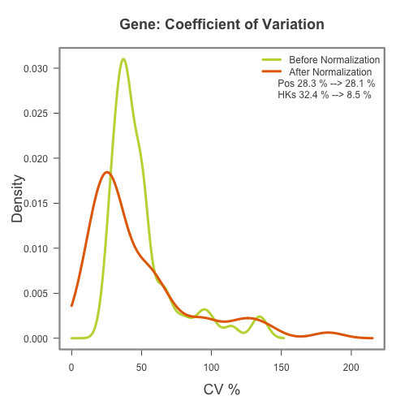
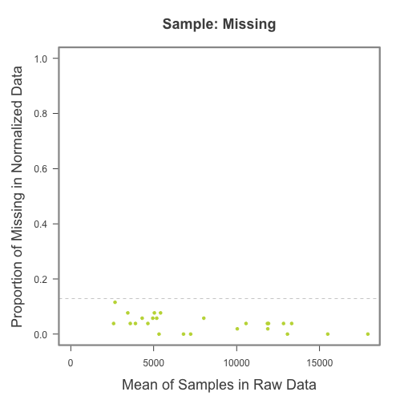
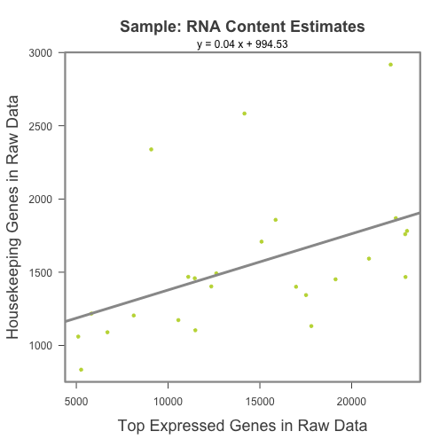
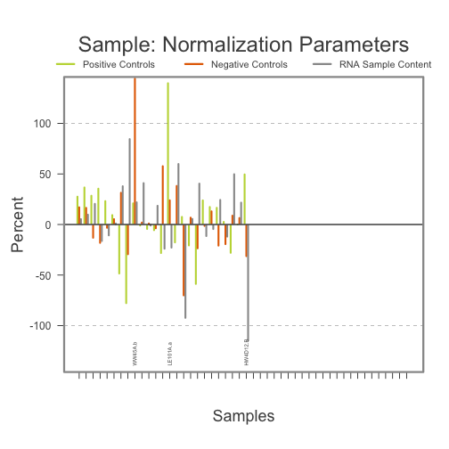
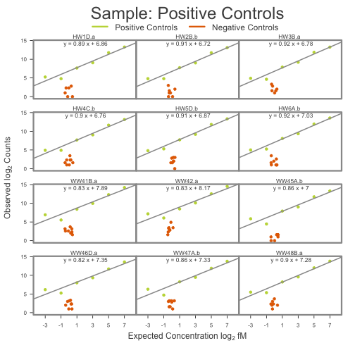
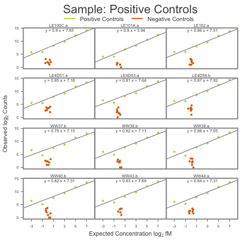
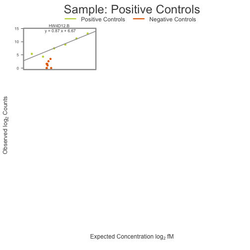

NanoStringNorm Trial
========================================================

The following code is designed to import, process, and analyze NanoString data from Todd Golde's experiments in APP (Tg) and normal (WT) mice models, with and without over-expression of IL-10.

Load the required libraries.

```r
require("NanoStringNorm")
```

```
## Loading required package: NanoStringNorm
## Loading required package: gdata
## gdata: read.xls support for 'XLS' (Excel 97-2004) files ENABLED.
## 
## gdata: read.xls support for 'XLSX' (Excel 2007+) files ENABLED.
## 
## Attaching package: 'gdata'
## 
## The following object is masked from 'package:stats':
## 
##     nobs
## 
## The following object is masked from 'package:utils':
## 
##     object.size
```

```r
library("ggplot2")
```


We first import the data and create a data frame using `read.table`.

```r
NanoString.mRNA <- read.table("./data/AD_nanoString_data.txt", fill = TRUE, 
    header = TRUE, as.is = TRUE)
```

```
## Warning: cannot open file './data/AD_nanoString_data.txt': No such file or
## directory
```

```
## Error: cannot open the connection
```

```r
str(NanoString.mRNA)
```

```
## 'data.frame':	68 obs. of  28 variables:
##  $ Code.Class: chr  "Positive" "Positive" "Positive" "Positive" ...
##  $ Name      : chr  "POS_A(128)" "POS_B(32)" "POS_C(8)" "POS_D(2)" ...
##  $ Accession : chr  "ERCC_00117.1" "ERCC_00112.1" "ERCC_00002.1" "ERCC_00092.1" ...
##  $ HW1D.a    : int  9917 3471 540 203 28 38 2 1 5 5 ...
##  $ HW2B.b    : int  8808 3418 522 215 28 28 1 2 4 2 ...
##  $ HW3B.a    : int  9754 3722 591 239 25 30 3 4 3 7 ...
##  $ HW4C.b    : int  9025 3191 527 204 30 30 3 5 5 2 ...
##  $ HW5D.b    : int  10230 3619 583 210 39 28 7 1 3 8 ...
##  $ HW6A.b    : int  12090 3903 652 270 38 32 3 2 4 6 ...
##  $ WW41B.a   : int  18979 5064 1005 342 46 121 9 9 5 6 ...
##  $ WW42.a    : int  23660 5953 1094 362 67 145 11 7 5 8 ...
##  $ WW45A.b   : int  10064 3399 525 241 22 58 3 1 2 2 ...
##  $ WW46D.a   : int  12176 3312 647 255 38 72 5 2 4 10 ...
##  $ WW47A.b   : int  13729 3754 708 305 26 77 7 2 3 8 ...
##  $ WW48B.a   : int  14055 4073 763 296 41 45 4 0 5 4 ...
##  $ LE100C.a  : int  18225 5001 904 301 57 54 7 3 4 3 ...
##  $ LE101A.a  : int  5505 1551 318 116 17 17 0 0 2 2 ...
##  $ LE102.a   : int  14951 4353 754 263 59 60 4 2 6 3 ...
##  $ LE4D51.a  : int  11133 3583 556 232 46 47 7 17 10 12 ...
##  $ LE4D53.a  : int  14264 4148 668 289 50 93 5 8 3 1 ...
##  $ LE4D56.b  : int  21404 5692 1068 366 74 78 9 11 9 6 ...
##  $ WW37.b    : int  9121 2780 437 174 25 99 5 4 6 5 ...
##  $ WW38.b    : int  10226 2835 566 206 30 65 5 4 1 1 ...
##  $ WW39.a    : int  11050 3250 617 208 23 65 10 2 5 4 ...
##  $ WW40.b    : int  12242 3393 651 183 35 85 4 6 1 10 ...
##  $ WW43.b    : int  15881 4291 859 262 56 88 10 2 0 11 ...
##  $ WW44.a    : int  12805 3604 637 218 40 67 8 6 3 5 ...
##  $ HW4D12.B  : int  8835 2393 483 180 20 42 1 3 2 6 ...
```


Some of the gene have duplicate names, so we add a simple tag to distinguish.

```r
duplicateNames <- duplicated(NanoString.mRNA$Name)
NanoString.mRNA$Name[duplicateNames] <- paste(NanoString.mRNA$Name[duplicateNames], 
    "-2", sep = "")
```


Next we define the housekeeping genes in the data.

```r
NanoString.mRNA[NanoString.mRNA$Name %in% c("Cltc", "GAPDH", "Hprt1", "Pgk1", 
    "Tubb5"), "Code.Class"] <- "Housekeeping"
```


Here we extract sample subsets, but just for the Tg data.

```r
annoCols <- colnames(NanoString.mRNA)[c(1:3)]
sampleIDs <- colnames(NanoString.mRNA)[-c(1:3)]
tgIL10Samples <- sampleIDs[c(1:3, 7:9)]
tgCtrlSamples <- sampleIDs[c(4:6, 10:12)]


tgNS.mRNA <- subset(x = NanoString.mRNA, select = colnames(NanoString.mRNA) %in% 
    c(annoCols, tgIL10Samples, tgCtrlSamples))
```


We want to build a trait indicator vector to look at differential expression among Tg samples.

```r
tg.names <- names(tgNS.mRNA)[-c(1:3)]
IL10vsCTRL <- (tg.names %in% tgIL10Samples) + 1  # value 2 indicates IL10 class
trait.tg <- data.frame(row.names = tg.names, IL10vsCTRL = IL10vsCTRL)
```


We also need to define the biological replicates belonging to each experimental group.

```r
tg.bioReps <- rep("", times = length(tg.names))
tg.bioReps[tg.names %in% tgIL10Samples] <- "Tg.IL10"
tg.bioReps[tg.names %in% tgCtrlSamples] <- "Tg.CTRL"
```


The `norm.comp` function allows us to examine all combinations of normalization options. `CodeCount` represents the correction based on positive controls, `Background` the correction based on negative controls, and `SampleContent` the correction based on housekeeping genes. 

```r
tg.norm.comp.results.test <- norm.comp(x = tgNS.mRNA, replicates = tg.bioReps, 
    CodeCount.methods = c("none", "sum", "geo.mean"), Background.methods = c("none", 
        "mean", "mean.2sd", "max"), SampleContent.methods = c("none", "housekeeping.sum", 
        "housekeeping.geo.mean", "total.sum", "low.cv.geo.mean", "top.mean", 
        "top.geo.mean"), OtherNorm.methods = "none", histogram = FALSE, verbose = FALSE, 
    icc.method = "anova")
```

```
## Loading required package: lme4
## Loading required package: Matrix
## Loading required package: Rcpp
```


To reduce technical variation that is independent of NanoString assay variation, we would like to keep at least some form of correction based on expression of housekeeping genes. As such, we can try to run `norm.comp` again, but with fewer options for `SampleContent` methods.

```r
tg.norm.comp.results.test <- norm.comp(x = tgNS.mRNA, replicates = tg.bioReps, 
    CodeCount.methods = c("none", "sum", "geo.mean"), Background.methods = c("none", 
        "mean", "mean.2sd", "max"), SampleContent.methods = c("housekeeping.sum", 
        "housekeeping.geo.mean"), OtherNorm.methods = "none", histogram = FALSE, 
    verbose = FALSE, icc.method = "anova")
```


Within this scope, there isn't a noticeable difference in the ratio of biological (i.e., endogenous genes) to technical (i.e., positive controls) variation (based on coefficient of variation). The intra-class correlation is around 0.6 for most combinations of options, but this metric might not be that informative anyway (we have no clear reason to assume strong correlation among genes within each group).

We ultimately would like to compare groups across different experiments, so we'll now take a look at all of the data (including Tg, WT, and old mice samples).

```r
norm.comp.results.test <- norm.comp(x = NanoString.mRNA, CodeCount.methods = c("none", 
    "sum", "geo.mean"), Background.methods = c("none", "mean", "mean.2sd", "max"), 
    SampleContent.methods = c("housekeeping.sum", "housekeeping.geo.mean"), 
    OtherNorm.methods = "none", histogram = FALSE, verbose = TRUE)
```

```
## [1] "none_none_housekeeping.sum_none"
## [1] "none_none_housekeeping.geo.mean_none"
## [1] "none_mean_housekeeping.sum_none"
## [1] "none_mean_housekeeping.geo.mean_none"
## [1] "none_mean.2sd_housekeeping.sum_none"
## [1] "none_mean.2sd_housekeeping.geo.mean_none"
## [1] "none_max_housekeeping.sum_none"
## [1] "none_max_housekeeping.geo.mean_none"
## [1] "sum_none_housekeeping.sum_none"
## [1] "sum_none_housekeeping.geo.mean_none"
## [1] "sum_mean_housekeeping.sum_none"
## [1] "sum_mean_housekeeping.geo.mean_none"
## [1] "sum_mean.2sd_housekeeping.sum_none"
## [1] "sum_mean.2sd_housekeeping.geo.mean_none"
## [1] "sum_max_housekeeping.sum_none"
## [1] "sum_max_housekeeping.geo.mean_none"
## [1] "geo.mean_none_housekeeping.sum_none"
## [1] "geo.mean_none_housekeeping.geo.mean_none"
## [1] "geo.mean_mean_housekeeping.sum_none"
## [1] "geo.mean_mean_housekeeping.geo.mean_none"
## [1] "geo.mean_mean.2sd_housekeeping.sum_none"
## [1] "geo.mean_mean.2sd_housekeeping.geo.mean_none"
## [1] "geo.mean_max_housekeeping.sum_none"
## [1] "geo.mean_max_housekeeping.geo.mean_none"
```


Using the geometric mean of housekeeping genes to scale endogenous genes appears to produce a higher biological to technical CV ratio, so we'll further reduce the `SampleContent` options. We can also remove the **none** options, as we definitely want to include some form of correction based on positive and negative controls.

```r
norm.comp.results.test <- norm.comp(x = NanoString.mRNA, CodeCount.methods = c("sum", 
    "geo.mean"), Background.methods = c("mean", "mean.2sd", "max"), SampleContent.methods = c("housekeeping.geo.mean"), 
    OtherNorm.methods = "none", histogram = FALSE, verbose = TRUE)
```

```
## [1] "sum_mean_housekeeping.geo.mean_none"
## [1] "sum_mean.2sd_housekeeping.geo.mean_none"
## [1] "sum_max_housekeeping.geo.mean_none"
## [1] "geo.mean_mean_housekeeping.geo.mean_none"
## [1] "geo.mean_mean.2sd_housekeeping.geo.mean_none"
## [1] "geo.mean_max_housekeeping.geo.mean_none"
```


All of the above combinations of options yield virtually identical results for normalization. Given this observation, we'll go ahead and use the *recommended* set of options in the `NanoStringNorm` manual. Some of our subsequent analyses will be based on relative expression, so we won't round expression values or log-normalize.

```r
NanoString.mRNA.norm <- NanoStringNorm(x = NanoString.mRNA, CodeCount = "geo.mean", 
    Background = "mean.2sd", SampleContent = "housekeeping.geo.mean", round.values = FALSE, 
    take.log = FALSE)
```

```
## 
## ##############################
## ### NanoStringNorm v1.1.17 ###
## ##############################
## 
## There are 25 samples and 52 Endogenous genes 
## 
## Background: After correction 25 samples and 52 
## 	Endogenous genes have less than 90% missing. 
## 
## SampleContent: The following samples have sample/rna content greater than 
## 	3 standard deviations from the mean.
## 
##          rna.zscore
## HW4D12.B       3.13
```

Finally, we'll generate some plots to summarize the results of the normalization.

```r
pdf("./results/NanoStringNorm_results.pdf")
```

```
## Error: cannot open file './results/NanoStringNorm_results.pdf'
```

```r
Plot.NanoStringNorm(x = NanoString.mRNA.norm, label.best.guess = TRUE, plot.type = c("cv", 
    "mean.sd", "RNA.estimates", "missing", "norm.factors", "positive.controls"))
```

        

```r
dev.off()
```

```
## null device 
##           1
```


Export the normalized data for subsequent analyses in Matlab.

```r
write.table(x = NanoString.mRNA.norm$normalized.data, file = "./results/AD_NanoStringNorm_data.txt", 
    sep = "\t")
```

```
## Warning: cannot open file './results/AD_NanoStringNorm_data.txt': No such
## file or directory
```

```
## Error: cannot open the connection
```


